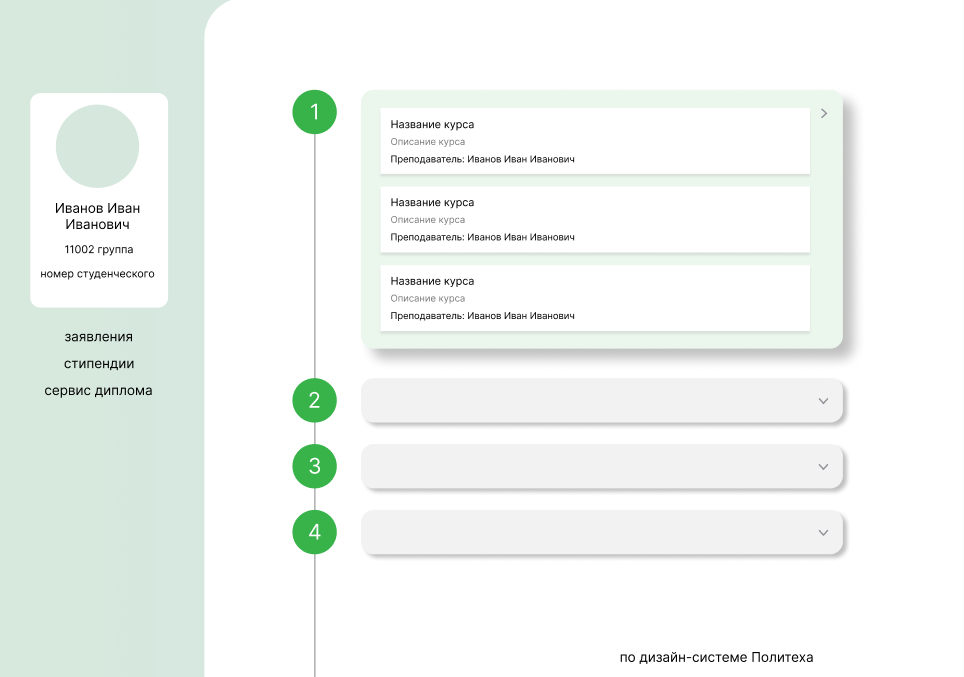

# Производственная практика 

Балашов Ярослав гр. 5130901/10201

## Введение
Название сервиса: Единое окно

Проблема: В рамках образовательного процесса студенты проходят множество онлайн-курсов на различных порталах. 
Как студентам понять, на каком сайте находится их курс и какие дисциплины им нужно проходить в этом семестре?

Цель: в рамках производственной практики разработать сервис "Единое окно", 
на котором будет реализована интеграция с одним из сайтов (openedu.ru), используемых в рамках образовательного процесса. 


## Схема данных

### Интерфейсы

Вход

+ Интерфейс информации о курсах
+ Интерфейс студентов и id курсов, на которые они должны быть записаны в этом семестре (`id студента => id курсов[]`)
+ Интерфейс авторизации

Выход
+ Список дисциплин с названием и прочими данными. Курсы сгруппированы по семестрам.

### Реализация для openedu

Вход

+ Таблица в формате csv с указанием названия, ключевых дат и id курса (допускается наличие и других данных)

+ Json-файл произвольной формы. В рамках практики считаем, что json имеет следующий формат:
```json
[
    {
        "student_id" : "spbstu<RECORDBOOK_1>",
        "courses" :
        [
            "<COURSE_ID_1_1>",
            "<COURSE_ID_1_2>",
            "<COURSE_ID_1_3>",
            ...
        ]
    },
    {
        "student_id" : "spbstu<RECORDBOOK_2>",
        "courses" :
        [
            "<COURSE_ID_2_1>",
            "<COURSE_ID_2_2>",
            "<COURSE_ID_2_3>",
            ...
        ]
    },
    ...
]
```
+ Сервис CAS
  + для студентов - CAS
  + для преподавателей и администраторов - логин/пароль

Выход
+ веб-сайт со структурированной информацией созданная по макету:



# Запуск

+ Установить composer-пакеты
+ Выполнить сборку в директории public
+ Миграция в базу данных
+ Сидирование базы данных (только для тестового сервера)

P.S. примеры json и csv файлов в папке example

